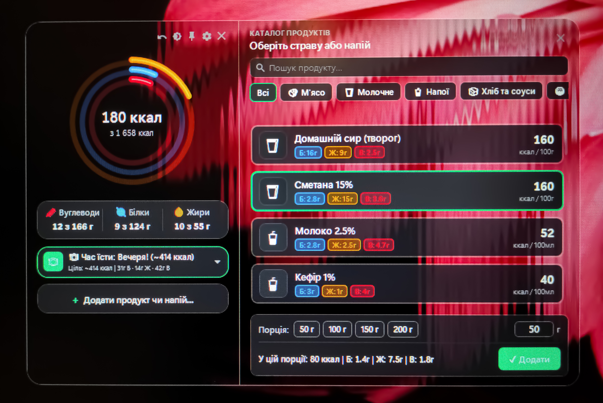

# CalWidget — Нативний віджет калорій та БЖВ для Windows

Легкий, швидкий та зручний нативний віджет для обліку калорій і макронутрієнтів (білки, жири, вуглеводи) у стилі фітнес-кілець (Macro Rings).



---

## Особливості

- **Фітнес-кільця БЖВ:** Три концентричні кільця для візуалізації жирів, білків та вуглеводів з плавними анімаціями.
- **Миттєвий перемикач тем:** Світла та темна теми з автозбереженням налаштувань.
- **Зручний каталог продуктів:** Додавання порцій у грамах або мілілітрах з швидкими кнопками вибору.
- **Власний калькулятор BMR / TDEE:** Автоматичний розрахунок норми за формулою Міффліна-Сан Жеора або ручне налаштування цілей.
- **Мінімальне споживання ресурсів:** Працює автономно, швидко запускається та не навантажує систему.

---

## Встановлення та запуск

### Спосіб 1. Запуск готового виконуваного файлу (рекомендовано)

1. Завантажте репозиторій або клонуйте його:
   ```cmd
   git clone https://github.com/nickson4k-svg/wiget.git
   cd wiget
   ```
2. Запустіть файл `run.bat` або безпосередньо `publish/CalWidget.exe`.

### Спосіб 2. Збірка з вихідного коду (.NET 8 SDK)

1. Переконайтеся, що у вас встановлено **.NET 8 SDK** (або новішу версію).
2. Відкрийте термінал у папці проєкту та виконайте:
   ```cmd
   dotnet publish -c Release -o publish
   ```
3. Запустіть згенерований `CalWidget.exe` із створеної папки `publish`.

---

## Структура проєкту

```text
├── assets/              # Скріншоти та медіа-файли
│   └── screenshot.png   # Скріншот програми для README
├── publish/             # Зібраний автономний файл CalWidget.exe
├── Models/              # Моделі даних
├── Services/            # Сервіси збереження, розрахунків та каталогу
├── Helpers/             # Допоміжні класи та анімації
├── App.xaml / MainWindow.xaml / SettingsWindow.xaml / AddFoodDialog.xaml
├── run.bat              # Скрипт для швидкого запуску
└── README.md            # Документація проєкту
```
